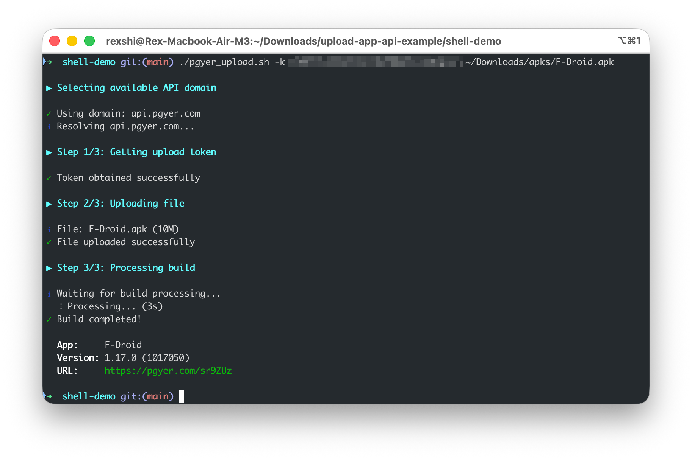

# shell 脚本使用说明

使用 curl 命令上传 app 安装包到蒲公英平台。

默认支持 Linux、Mac 平台。如需在 Windows 上使用，请安装 [git bash](https://gitforwindows.org)。



## 使用说明

为脚本赋予执行权限：

    chmod +x ./pgyer_upload.sh

执行命令：

    ./pgyer_upload.sh -k <your-pgyer-api-key> <your-ipa-or-apk-or-hap-file-path>

## 输出

上传成功后，默认输出应用名称、版本号和下载页面 URL。如需输出完整 JSON 结果，请增加 `-j` 参数。

示例输出：
```
✓ Build completed!

  App:     F-Droid
  Version: 1.18.0 (1018000)
  URL:     https://www.pgyer.com/xxxx
```

## 参数说明

### 必需参数

- `-k <api_key>` - 蒲公英 API Key（必填）

### 可选参数

- `-t <buildInstallType>` - 安装方式：1=公开，2=密码，3=邀请
- `-p <buildPassword>` - 安装密码（当 buildInstallType=2 时必填）
- `-d <buildUpdateDescription>` - 版本更新描述
- `-e <buildInstallDate>` - 安装有效期：1=自定义时间段，2=永久
- `-s <buildInstallStartDate>` - 安装开始日期，格式：yyyy-MM-dd
- `-e <buildInstallEndDate>` - 安装结束日期，格式：yyyy-MM-dd
- `-c <buildChannelShortcut>` - 渠道标识
- `-P` - 显示上传进度条（默认关闭）
- `-j` - 输出完整 JSON 响应结果
- `-v` - 详细模式，显示详细的 curl 命令和连接测试信息
- `-h` - 显示帮助信息

### 示例

基本用法：
```bash
./pgyer_upload.sh -k c3bb8fde1919514f8fb4d8694d38b4e2 ~/Downloads/app.apk
```

显示上传进度：
```bash
./pgyer_upload.sh -k c3bb8fde1919514f8fb4d8694d38b4e2 -P ~/Downloads/app.apk
```

详细模式：
```bash
./pgyer_upload.sh -k c3bb8fde1919514f8fb4d8694d38b4e2 -v ~/Downloads/app.apk
```

设置密码安装：
```bash
./pgyer_upload.sh -k c3bb8fde1919514f8fb4d8694d38b4e2 -t 2 -p 123456 ~/Downloads/app.apk
```

## 日志与调试

### 日志控制

默认为开启状态（`LOG_ENABLE=1`）。您可以修改脚本中的 `LOG_ENABLE=0` 来关闭日志。

日志会显示彩色的状态信息：
- ✓（绿色）：成功
- ℹ（蓝色）：信息
- ⚠（黄色）：警告
- ✗（红色）：错误

### 详细模式

使用 `-v` 参数启用详细模式，可以看到：
- 域名连接测试详情
- DoH 域名解析结果
- 详细的 curl 命令

这在遇到网络问题时非常有用。

### 进度条

上传文件时，默认不显示进度条。如需显示上传进度，请添加 `-P` 参数。

## Windows 用户

1. 安装 [git bash](https://gitforwindows.org)，以便让 windows 具备 bash 环境
2. 以`bash.exe`来执行 `pgyer_upload.sh` 脚本

命令如下（注意您的安装目录可能有所不同，请相应替换）：

    D:\> & 'C:\Program Files\Git\bin\bash.exe' .\pgyer_upload.sh -k <your-pgyer-api-key> <your-ipa-or-apk-or-hap-file>

完成后，就会直接返回 App 的上传结果

## 问题排查

如果遇到上传问题，建议：

1. 使用 `-v` 参数启用详细模式查看详细信息
2. 检查网络连接是否正常
3. 确认 API Key 是否正确
4. 确认文件路径是否正确，文件是否有读取权限

